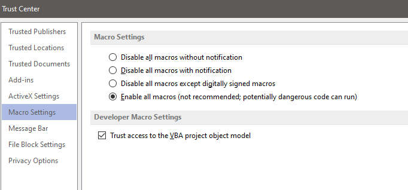

Installation & Requirements
###########################

Requirements
************

	1. python >= 3.8
	2. Excel.
	3. MS-Visio
	4. Visio stencil(s)
	5. facts-finder (python package)
	6. capture-it (python package)

------------------

Installation / Update
*********************

Install the pyVig package using pip::

    pip install --upgrade pyVig
	
here are many other ways to install packages such as conda install or manual wheel file download and install.
You can do it as per your prefered choice of installation.
	

---------------------------

Inherited python packages
*************************

	1. pandas
	2. nettoolkit
	3. numpy
	4. pySimplyGUI
	5. pywin32 ( may require manual install )
 

-------------------------------------

Do this: Enable Macros for MS-Visio
***********************************

Enable all macros from Trust Center settings in order to allow visio access for script.

