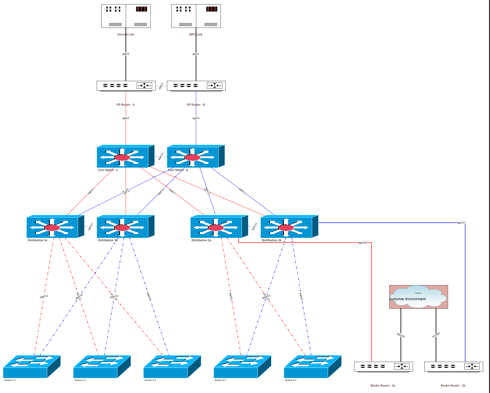
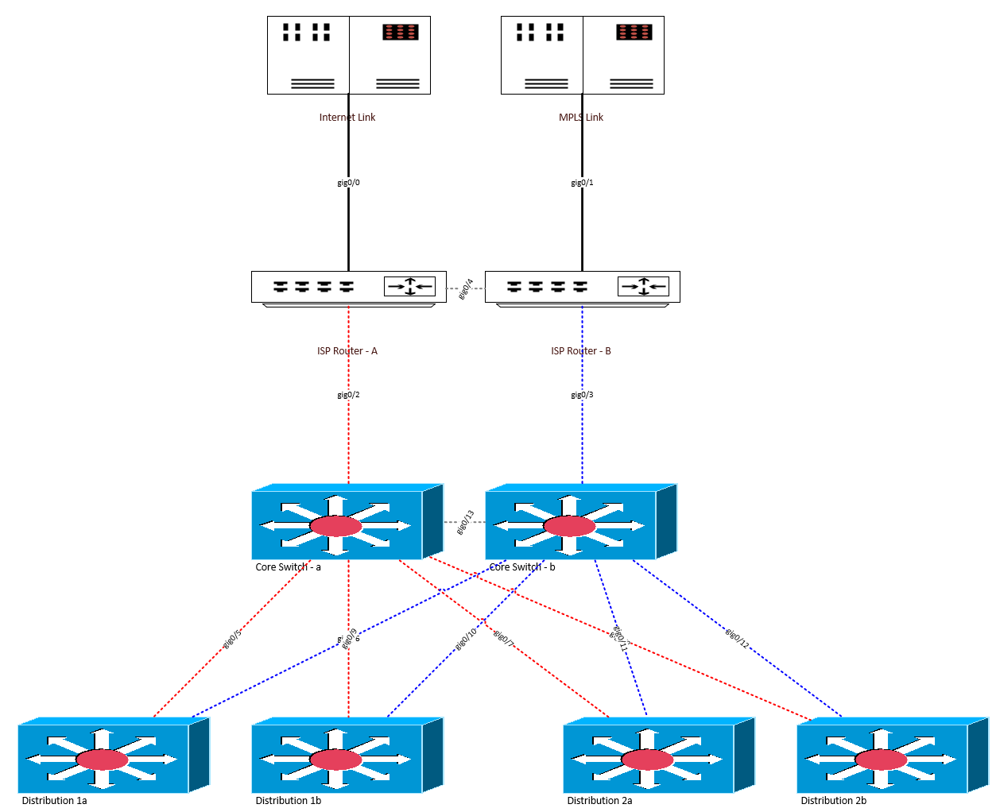
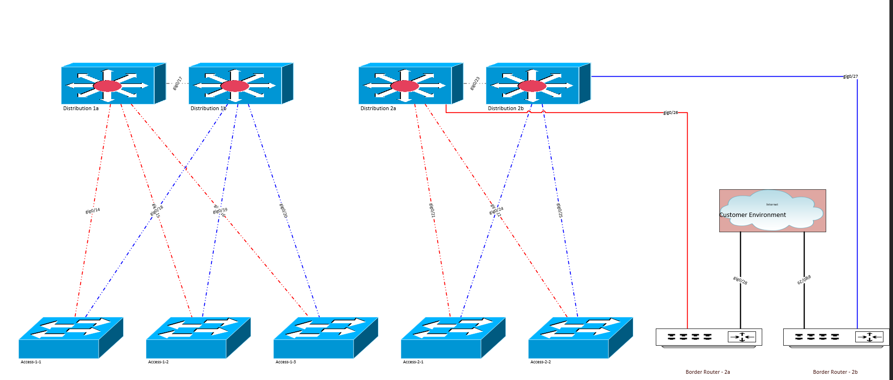

Excel database Samples
===========================

pyVig readable sample excel file 
---------------------------------

:download:`Sample <samples/Excel-pyvig-sample.xlsx>`. pyVig readable Sample Excel file with Devices and Cablings Tab.

A Sample Stencil : Network and Peripherals
---------------------------------

:download:`Stencil <samples/Network and Peripherals.vssx>`. Sample stencil used in above database example.

Devices Table Sample
---------------------------------

.. csv-table:: Devices
   :file: samples/devices.csv
   :header-rows: 1   

Cablings Table Sample
---------------------------------

.. csv-table:: Cablings
   :file: samples/cablings.csv
   :header-rows: 1

Output: when no sheet_filters provided
--------------------------------

Here is a sample output with given database when no filters selected in input.

Output2: Tab1 when sheet_filters applied
--------------------------------

Here is a sample output of `core` tab when **sheet_filters** is enabled in input.

Output3: Tab2 when sheet_filters applied
--------------------------------

Here is a sample output of `access` tab when **sheet_filters** is enabled in input.

